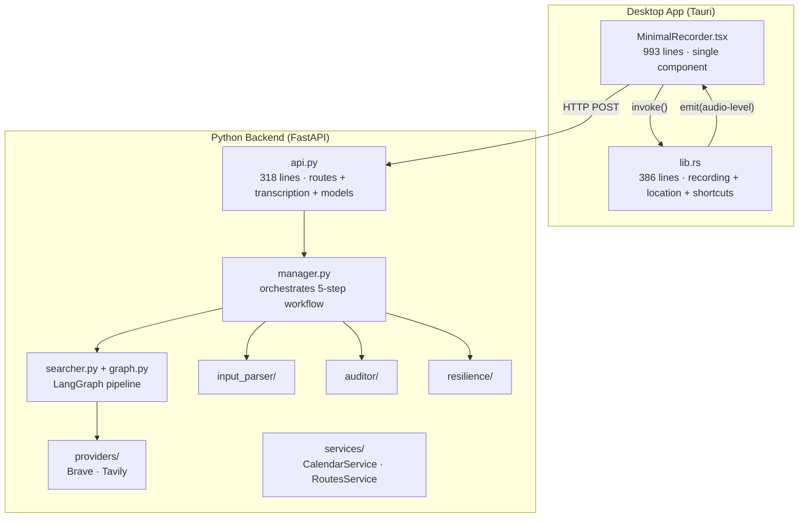
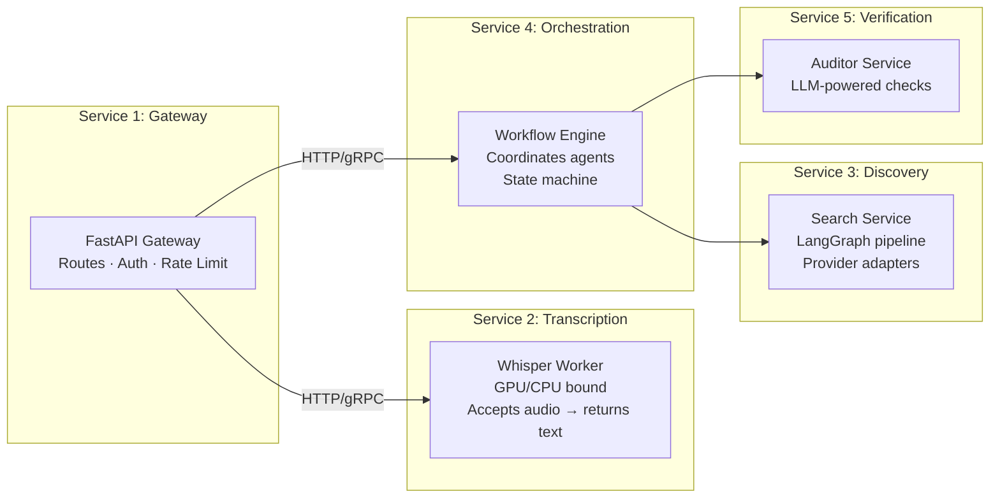

# EventFinder Codebase Audit

**Date:** 2026-02-17
**Scope:** Full-stack review — Python backend, Tauri/Rust core, React frontend

---

## 1. Current Architecture At a Glance



### Component Inventory

| Component | Files | Lines | Role |
|-----------|-------|-------|------|
| `api.py` | 1 | 318 | Routes, models, **and** transcription logic |
| `orchestration/` | 1 | 182 | 5-step workflow manager |
| `discovery_agent/` | 5 | ~430 | LangGraph search pipeline + providers |
| `input_parser/` | 1 | 109 | Voice-to-intent (placeholder NLP) |
| `auditor/` | 1 | 113 | Free-event verification |
| `resilience/` | 1 | 123 | Edge-case / retry strategies |
| `services/` | 2 | ~230 | Calendar & routes (stubs) |
| `location/` | 2 | ~100 | Geocoding helpers |
| `lib.rs` | 1 | 386 | Audio recording, location persistence, shortcuts |
| `MinimalRecorder.tsx` | 1 | 993 | Entire UI |

---

## 2. Issues Found

### 2.1 Bugs & Code Smells

| Severity | File | Issue |
|----------|------|-------|
| 🔴 **Bug** | `providers/base.py:35` | `timeout_seconds: string` — should be `int`. Will crash at runtime if `Config` is ever instantiated. |
| 🔴 **Bug** | `providers/tavily.py` | `search()` returns raw Tavily dict, not `List[SearchResult]`. Breaks the Protocol contract. |
| 🔴 **Bug** | `searcher.py:100` | `results.keys()` called on what may be a list — will throw `AttributeError`. |
| 🟡 **Smell** | `searcher.py` | 6 `print()` debug statements left in production code. |
| 🟡 **Smell** | `manager.py` | 2 `print()` debug statements in the workflow pipeline. |
| 🟡 **Smell** | `api.py` | 1 `print()` in search response path. |
| 🟡 **Smell** | `providers/tavily.py:10` | Docstring says *"Brave Search API"* — copy-paste leftover. |
| 🟡 **Smell** | `api.py` | Imports after `if __name__` block (lines 183–201). Module-level side effects. |
| 🟠 **Debt** | `base.py` | `Config` dataclass on `SearchProvider` Protocol is unused by Tavily. Dead abstraction. |

### 2.2 Architectural Concerns

#### A. `api.py` is a God File (318 lines, 3 responsibilities)
It handles:
1. Route definitions and Pydantic models
2. Agent initialization and wiring
3. Audio transcription (Whisper model loading, ffmpeg conversion, temp file management)

These are three distinct concerns jammed into one file.

#### B. Frontend is a Single 993-Line Component
`MinimalRecorder.tsx` contains:
- Recording logic
- Transcription flow
- Search/results UI
- Location management
- Canvas visualization
- Keyboard shortcuts
- All 290+ lines of inline styles

This is hard to test, review, or extend.

#### C. No Dependency Injection
Agents are instantiated as module-level globals in `api.py`:
```python
input_parser = InputParser()
discovery_agent = DiscoveryAgent(tavily_provider)
auditor = Auditor()
```
This makes testing, configuration, and lifecycle management fragile.

#### D. Rust Core Mixes Concerns
`lib.rs` handles audio recording, WAV encoding, location persistence, and window shortcuts in a single flat file.

#### E. Synchronous Pipeline for I/O-Bound Work
`manager.py` calls all agents synchronously. Web searches, LLM calls, and calendar lookups are inherently I/O-bound but run sequentially on the main thread.

---

## 3. SOA / Microservice Recommendations

### 3.1 Proposed Service Boundaries



### 3.2 Why Split?

| Current Pain | Service Fix |
|--------------|-------------|
| Whisper model blocks the FastAPI event loop | Transcription Worker can scale independently, run on GPU |
| Adding a new search provider touches `searcher.py` + `graph.py` | Discovery Service owns its own providers and pipeline |
| Auditor LLM calls are slow and could timeout the main request | Verification Service scales separately |
| Testing requires spinning up the entire stack | Each service has its own test suite and contract |

### 3.3 Recommended Migration Path (Incremental)

> [!IMPORTANT]
> You don't need to deploy Kubernetes on day one. Start by splitting the **Python monolith into separate FastAPI apps** behind a reverse proxy.

**Phase 1 — Immediate cleanup (no architecture change)**
1. Extract transcription into `src/transcription/` module
2. Move Pydantic models to `src/models/`
3. Create `src/deps.py` for dependency injection (FastAPI `Depends()`)
4. Remove all `print()` statements; use `logging`
5. Fix the bugs listed in §2.1

**Phase 2 — Internal service boundaries**
1. Split `api.py` into three routers: `routers/search.py`, `routers/transcription.py`, `routers/verify.py`
2. Make `Manager.execute_workflow()` async with `asyncio`
3. Add Pydantic response validation to Tavily provider (normalize to `SearchResult`)

**Phase 3 — Extract Transcription Service**
1. Move Whisper logic into its own FastAPI app (`services/transcription/`)
2. Gateway calls it via HTTP or a task queue (Celery/Redis)
3. This is the highest-value split: Whisper is CPU/GPU intensive and blocks everything else

**Phase 4 — Full SOA (if needed)**
1. Extract Discovery and Verification into separate services
2. Introduce message queue (Redis Streams or RabbitMQ) for async orchestration
3. Each service gets its own `Dockerfile` and health check

### 3.4 Frontend Recommendations

| Area | Suggestion |
|------|------------|
| Component split | Break `MinimalRecorder.tsx` into: `RecordingView`, `TranscriptionView`, `ResultsView`, `LocationModal`, `WaveformCanvas` |
| Styles | Extract inline `styles` object to a CSS module or separate `.css` file |
| State management | Consider `useReducer` or a small state machine lib (`xstate`) for the FSM |
| Rust core | Split `lib.rs` into modules: `audio.rs`, `location.rs`, `commands.rs` |

---

## 4. Quick Wins Checklist

- [ ] Fix `timeout_seconds: string` → `int` in `base.py`
- [ ] Normalize Tavily response to `List[SearchResult]`
- [ ] Remove all `print()` debugging (9 instances across 3 files)
- [ ] Fix copy-paste docstring in `tavily.py`
- [ ] Extract transcription logic from `api.py` into `src/transcription/`
- [ ] Add `logging.getLogger(__name__)` to modules that lack it
- [ ] Move Pydantic models to `src/models/schemas.py`
